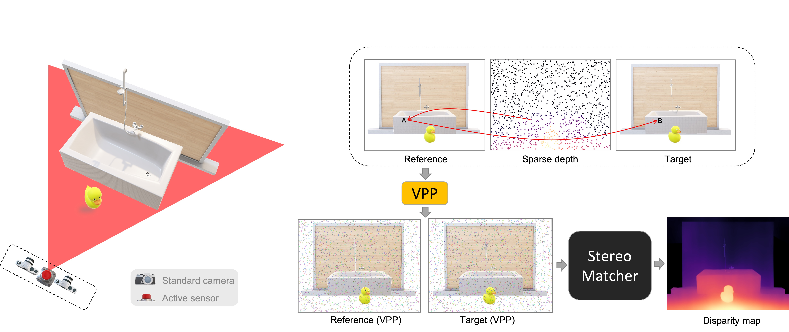
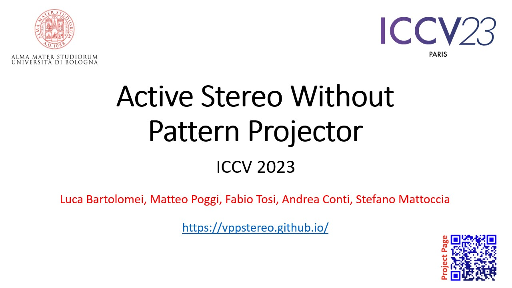
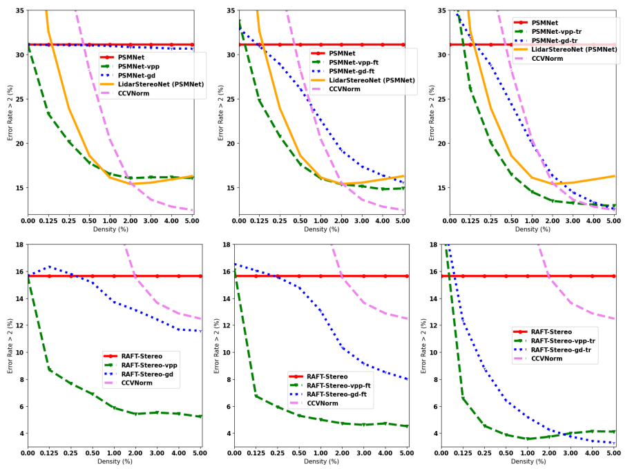
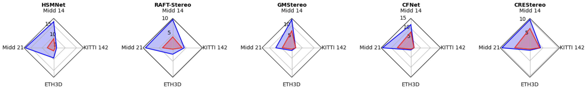
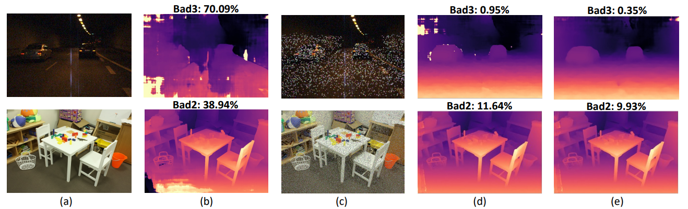
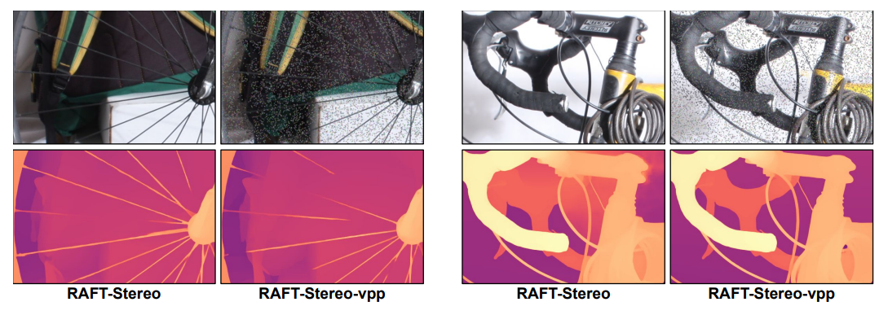

<h1 align="center"> Active Stereo Without Pattern Projector (ICCV 2023) </h1> 


<br>

:rotating_light: This repository contains download links to our code, and trained deep stereo models of our work  "**Active Stereo Without Pattern Projector**",  [ICCV 2023](https://iccv2023.thecvf.com/)
 
by [Luca Bartolomei](https://bartn8.github.io/)<sup>1,2</sup>, [Matteo Poggi](https://mattpoggi.github.io/)<sup>2</sup>, [Fabio Tosi](https://fabiotosi92.github.io/)<sup>2</sup>, [Andrea Conti](https://andreaconti.github.io/)<sup>2</sup>, and [Stefano Mattoccia](https://github.com/stefano-mattoccia)<sup>1,2</sup>

Advanced Research Center on Electronic System (ARCES)<sup>1</sup>
University of Bologna<sup>2</sup>

<div class="alert alert-info">


<h2 align="center"> 

[Project Page](https://vppstereo.github.io/) | [Paper](https://vppstereo.github.io/assets/paper.pdf) |  [Supplementary](https://vppstereo.github.io/assets/paper-supp.pdf) | [Poster](https://vppstereo.github.io/assets/poster.pdf)
</h2>

**Note**: 🚧 Kindly note that this repository is currently in the development phase. We are actively working to add and refine features and documentation. We apologize for any inconvenience caused by incomplete or missing elements and appreciate your patience as we work towards completion.

## :bookmark_tabs: Table of Contents

- [:bookmark\_tabs: Table of Contents](#bookmark_tabs-table-of-contents)
- [:clapper: Introduction](#clapper-introduction)
- [:movie\_camera: Watch Our Research Video!](#movie_camera-watch-our-research-video)
- [:inbox\_tray: Pretrained Models](#inbox_tray-pretrained-models)
- [:memo: Code](#memo-code)
  - [:hammer\_and\_wrench: Setup Instructions](#hammer_and_wrench-setup-instructions)
- [:rocket: Test](#rocket-test)
- [:art: Qualitative Results](#art-qualitative-results)
- [:envelope: Contacts](#envelope-contacts)
- [:pray: Acknowledgements](#pray-acknowledgements)

</div>

## :clapper: Introduction
This paper proposes a novel framework integrating the principles of active stereo in standard passive camera systems without a physical pattern projector.
We virtually project a pattern over the left and right images according to the sparse measurements obtained from a depth sensor.


<h4 align="center">

</h4>




**Contributions:** 

* Even with meager amounts of sparse depth seeds (e.g., 1% of the whole image), our approach outperforms by a large margin state-of-the-art sensor fusion methods based on handcrafted algorithms and deep networks.

* When dealing with deep networks trained on synthetic data, it dramatically improves accuracy and shows a compelling ability to tackle domain shift issues, even without additional training or fine-tuning.

* By neglecting a physical pattern projector, our solution works under sunlight, both indoors and outdoors, at long and close ranges with no additional processing cost for the original stereo matcher.


:fountain_pen: If you find this code useful in your research, please cite:

```bibtex
@InProceedings{Bartolomei_2023_ICCV,
    author    = {Bartolomei, Luca and Poggi, Matteo and Tosi, Fabio and Conti, Andrea and Mattoccia, Stefano},
    title     = {Active Stereo Without Pattern Projector},
    booktitle = {Proceedings of the IEEE/CVF International Conference on Computer Vision (ICCV)},
    month     = {October},
    year      = {2023},
    pages     = {18470-18482}
}
```

## :movie_camera: Watch Our Research Video!

<a href="https://vppstereo.github.io/#myvideo">
  
</a>


## :inbox_tray: Pretrained Models

Here, you can download the weights of **RAFT-Stereo** and **PSMNet** architectures. 
- **Vanilla Models**: these models are pretrained on Sceneflow vanilla images and Middlebury vanilla images
  - PSMNet vanilla models: _psmnet/sceneflow/psmnet.tar_, _psmnet/middlebury/psmnet.tar_
  - RAFT-Stereo vanilla models (_raft-stereo/sceneflow/raftstereo.pth_ and _raft-stereo/middlebury/raftstereo.pth_) are just a copy from [authors' drive](https://drive.google.com/drive/folders/1booUFYEXmsdombVuglatP0nZXb5qI89J)
- **Fine-tuned Models**: starting from vanilla models, these models (_*-vpp-ft.tar_) are finetuned in the same domain but with virtual projected images
- **Models trained from scratch**: these models (_*-vpp-tr.tar_) are trained from scratch using virtual projected images


To use these weights, please follow these steps:

1. Install [GDown](https://github.com/wkentaro/gdown) python package: `pip install gdown`
2. Download all weights from our drive: `gdown --folder https://drive.google.com/drive/folders/1GqcY-Z-gtWHqDVMx-31uxrPzprM38UJl?usp=drive_link`

## :memo: Code

The **Test** section provides scripts to evaluate disparity estimation models on datasets like **KITTI**, **Middlebury**, and **ETH3D**. It helps assess the accuracy of the models and saves predicted disparity maps.

Please refer to each section for detailed instructions on setup and execution.

<div class="alert alert-info">

**Warning**:
- Please be aware that we will not be releasing the training code for deep stereo models. The provided code focuses on evaluation and demonstration purposes only. 
- With the latest updates in PyTorch, slight variations in the quantitative results compared to the numbers reported in the paper may occur.

</div>


### :hammer_and_wrench: Setup Instructions

1. **Dependencies**: Ensure that you have installed all the necessary dependencies. The list of dependencies can be found in the `./requirements.txt` file.
2. **Build rSGM**: 
  - Firstly, please initialize and update **git submodules**: `git submodule init; git submodule update`
  - Go to `./thirdparty/stereo-vision/reconstruction/base/rSGM/`
  - Build and install pyrSGM package: `python setup.py build_ext --inplace install`


## :rocket: Test

This code snippet allows you to evaluate the disparity maps on various datasets, including [KITTI (142 split)](https://www.cvlibs.net/datasets/kitti/o), [Middlebury (Training, Additional, 2021)](https://vision.middlebury.edu/stereo/data/), and [ETH3D](https://www.eth3d.net/). By executing the provided script, you can assess the accuracy of disparity estimation models on these datasets.

To run the `test.py` script with the correct arguments, follow the instructions below:

1. **Run the test**:
   - Open a terminal or command prompt.
   - Navigate to the directory containing the `test.py` script.

2. **Execute the command**:
   Run the following command, replacing the placeholders with the actual values for your images and model:

   ```shell
   python test.py  --datapath <path_to_dataset> --dataset <dataset_type> --stereomodel <model_name> \
    --loadstereomodel <path_to_pretrained_model> --maxdisp 192 \
    --vpp --outdir <save_dmap_dir> --wsize 3 --guideperc 0.05 --blending 0.4 --iscale <input_image_scale> \
    --maskocc

   ```

  Replace the placeholders (<max_disparity>, <path_to_dataset>, <dataset_type>, etc.) with the actual values for your setup.

  The available arguments are:

  - `--maxdisp`: Maximum disparity range for PSMNet and rSGM (default 192).
  - `--stereomodel`: Stereo model type. Options: `raft-stereo`, `psmnet`, `rsgm`
  - `--datapath`: Specify the dataset path.
  - `--dataset`: Specify dataset type. Options: `kitti_stereo142`, `middlebury_add`, `middlebury2021`, `middlebury`, `eth3d`
  - `--outdir`: Output directory to save the disparity maps.
  - `--loadstereomodel`: Path to the pretrained model file.
  - `--iscale` Rescale input images before apply vpp and stereo matching. Original size is restored before evaluation. Example: `--iscale 1` equals full scale, `--iscale 2` equals half scale.
  - `--guideperc`: Simulate depth seeds using a certain percentage of randomly sampled GT points. Valid only if raw depth seed not exists.
  - `--vpp`: Apply virtual patterns to stereo images (Default: True)
  - `--colormethod`: Virtual pattering strategy. Options: `rnd` (i.e., random strategy) and `maxDistance` (i.e., histogram based strategy)
  - `--uniform_color`: Uniform patch strategy
  - `--wsize`: Pattern patch size (e.g., 1, 3, 5, 7, ...)
  - `--wsizeAgg_x`: Histogram based search window width
  - `--wsizeAgg_y`: Histogram based search window height
  - `--blending`: Alpha-bleding between original images and virtual pattern
  - `--maskocc`: Use proposed occlusion handling
  - `--discard_occ`: Use occlusion point discard strategy
  - `--guided`: Apply Guided Stereo Matching strategy

For more details, please refer to the `test.py` script.

## :art: Qualitative Results

In this section, we present illustrative examples that demonstrate the effectiveness of our proposal.

<br>

<p float="left">
  
</p>
 
**Performance against competitors.** We can notice that VPP generally reaches almost optimal performance with a meagre 1% density and, except few cases in the -tr configurations with some higher density, achieves much lower error rates.
 
<br>

<p float="left">
  
</p>

**VPP with off-the-shelf networks.** We collects the results yielded VPP applied to several off-the-shelf stereo models, by running
the weights provided by the authors. Again, VPP sensibly boosts the accuracy of any model with rare exceptions, either trained on synthetic or real data.

<br>

<p float="left">
  
</p>

**Qualitative Comparison on KITTI (top) and Middlebury (bottom).** From left to right: vanilla left images and disparity maps by PSMNet model, left images enhanced by our virtual projection and disparity maps by vanilla PSMNet model and (most right) vpp fine tuned PSMNet model.


<br>

<p float="left">
  
</p>

**Fine-details preservation**: We can appreciate how our virtual pattern can greatly enhance the quality of the disparity maps, without introducing relevant artefacts in correspondence of thin structures – despite applying the pattern on patches.


## :envelope: Contacts

For questions, please send an email to luca.bartolomei5@unibo.it


## :pray: Acknowledgements

We would like to extend our sincere appreciation to the authors of the following projects for making their code available, which we have utilized in our work:

- We would like to thank the authors of [PSMNet](https://github.com/JiaRenChang/PSMNet), [RAFT-Stereo](https://github.com/princeton-vl/RAFT-Stereo),[rSGM](https://github.com/ivankreso/stereo-vision) for providing their code, which has been instrumental in our stereo matching experiments.

We deeply appreciate the authors of the competing research papers for provision of code and model weights, which greatly aided accurate comparisons.
